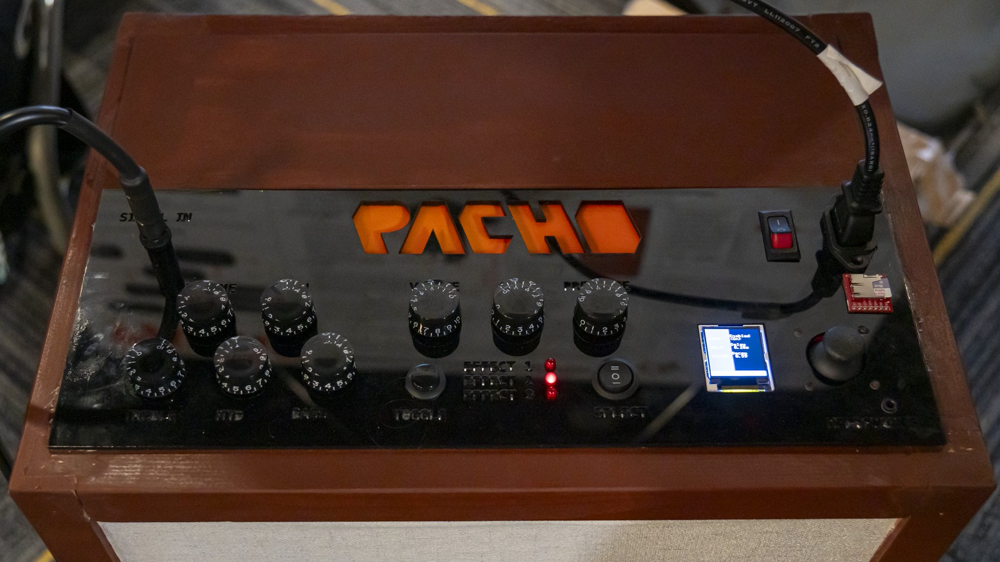

# RGA
Home for all things RGA (Recording Guitar Amplifier) related.
See included repositories for code, board design, and enclosure design.

## Device
The RGA device is an inexpensive guitar amplifier that also has built in recording and effects (both analog and digital). The purpose of this project is to make a low cost, all in one device that allows musicians to create and record music. By making the one device all encompasing, it reduces the need to buy numerous other devices and greatly lowers production cost.

## Documentation
[documentation hub](https://github.com/kyledenobel/RGA/tree/main/Organizational/documentation%20hub)

## Features
### Analog Effects
- Big Muff
- Phase 90
- Overdrive
### Digital Effects
- Delay
- Drop
- Tuner
### Outputs
- Speaker Output
- 3.5 mm Jack Output
### Additional Features
- Recording via SD Card
- Base, Middle, and Treble Control

## Cloning Project
$ `git clone https://github.com/kyledenobel/RGA --recurse-submodules `

## Keeping The Project Up to Date

$ `git submodule update --remote --merge`

if `git status` shows modified

$ `git commit -a -m "<message>"`

$ `git push`

## Device Image
The following images are from the Spring 2026 Design Expo at Georgia Tech:

<ins> Front of RGA </ins>

<ins> RGA User Interface </ins>

<ins> Team Photo at Expo </ins>

<ins> Poster for Expo </ins>

